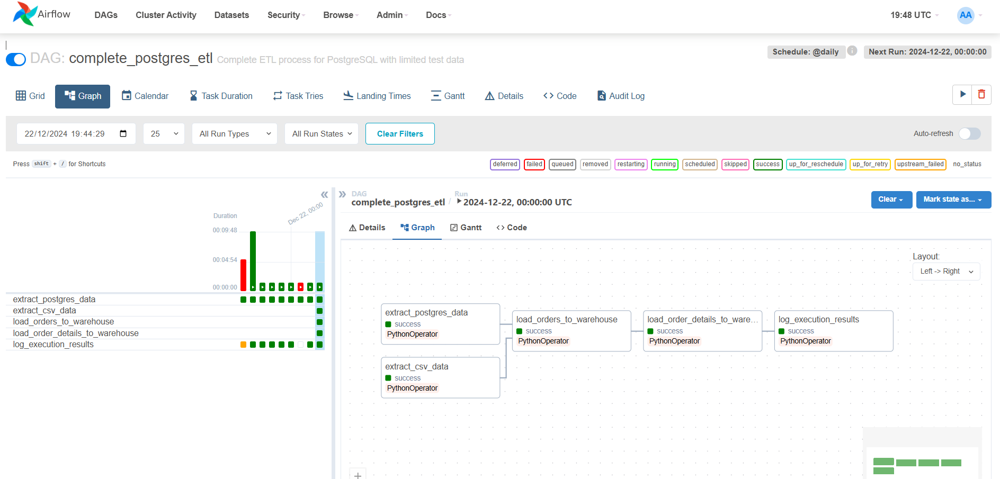

# Data POC


## Requirements

- Docker
- Docker Compose
- Python 3.x (for Airflow and required libraries)

## Project Structure

The project consists of the following files and directories:

- **DAGs**: Definition of Airflow tasks and workflow.
- **Docker Compose**: Configuration of the necessary containers (Airflow, PostgreSQL, etc.).
- **Python Scripts**: ETL functions to extract, transform, and load data.

## How to Run:

### 1. Clone the Repository
### 2. Update Environment Variables
Modify the .env file with appropriate environment variables.

### 3. Start Docker
docker-compose up -d

### 4. Airflow UI
localhost:8080


### 4. Create Connections in Airflow

After accessing the Airflow interface, you need to configure the connections to the databases used in the project. Follow the steps below:

1. Go to the Admin menu in the Airflow interface.
2. Select Connections.
3. Click + to add a new connection.
4. Create the following connections:

   - **northwind_db**: 
     - **Conn Id**: `northwind_db`
     - **Conn Type**: `Postgres`
     - **Host**: `northwind_db` 
     - **Schema**: `northwind`
     - **Login**: `northwind_user`
     - **Password**: `thewindisblowing`
     - **Port**: `5433`
   
   - **new_postgres_db**: 
     - **Conn Id**: `new_postgres_db`
     - **Conn Type**: `Postgres`
     - **Host**: `new_postgres_db`
     - **Schema**: ``
     - **Login**: ``
     - **Password**: ``
     - **Port**: `5434`

---
### 5. Init DAG
Airflow will execute the DAG for all dates that are pending from the start_date to the current date.

---

## 6. How to Reprocess Data with a Date Range using the CLI

The Airflow CLI is not available through the UI. It must be accessed via the terminal/command line. If you're using Docker, follow these steps:

1. Access the Airflow container:
   ```bash
   docker exec -it [your-airflow-container-name] bash
2. Run the command:
    ```bash
    airflow dags backfill -s 2024-01-01 -e 2024-01-05 indicium_challenge_etl bash
### 7. How to Reprocess Data with a Date Range in the Airflow UI:

1. Open your DAG in the Airflow UI.
2. Click on the **"Grid View"** tab.
3. In the grid view, you will see squares representing each daily execution.

### To select multiple days:
- Click on the first desired day.
- Hold down the mouse button.
- Drag to the last desired day.
- Release the mouse button.

4. Click on the **"Clear"** button in the top menu.
5. Confirm the action in the pop-up window.

This will trigger the reprocessing for the selected date range.

---

## ETL Evidance


---

obs: I set a query limit, but this can be adjusted. My computer is running a bit slow, and to test it, it was better to use just a few data points.
In the code:
SELECT * FROM {table} LIMIT 3
df = pd.read_csv(csv_path, nrows=3)
